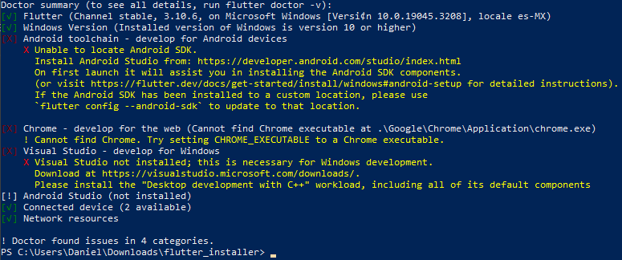

# Flutter Installer

[*Read this guide in English*](README.md)

Este es un script de PowerShell desarrollado para facilitar la instalación de
Flutter en equipos con Windows.

## Guía de Usuario

Para usar esta herramienta, debes [descargarla](FlutterInstaller.ps1) y ejecutar
PowerShell como Administrador. Una vez ahí, tienes que ejecutar el siguiente
comando:

```powershell
Set-ExecutionPolicy Bypass -Scope Process -Force
```
A continuación debes ejecutar la herramienta, yendo a la carpeta en la que la
descargaste:

```powershell
# Este es un ejemplo, podrías tener el archivo en otro lugar
cd C:\Users\Daniel\Downloads\
.\FlutterInstaller.ps1
```
Cuando presiones Enter, la herramienta va a comenzar a descargar e instalar
todo. Al final (va a tardar un buen rato), deberías ver algo como esto:



¡Esto significa que has instalado Flutter con éxito! Para desarrollar para
Android, deberás instalar las [herramientas de desarrollo para Android](https://docs.flutter.dev/get-started/install/windows#android-setup).
Para la web, solo necesitas tener instalado [Google Chrome](https://www.google.com/intl/es-419/chrome/).
Para desarrollar para Windos, necesitarás instalar [Visual Studio](https://docs.flutter.dev/get-started/install/windows#windows-setup).

## Más Información

Esta herramienta instala los siguientes paquetes en tu ordenador:
* [Chocolatey](https://chocolatey.org/) (Para instalar Git y FVM)
* [Git](https://git-scm.com/)
* [FVM](https://fvm.app/) (Es un CLI para gestionar las versiones SDK de Flutter)
* [Flutter](https://flutter.dev/)

También actualiza la variable de entorno `PATH` después de instalar Flutter.