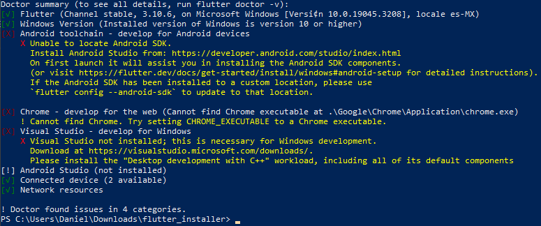

# Flutter Installer

This is a PowerShell script developed to make the installation of Flutter easier
on Windows devices.

## User's Guide

To use this tool, you have to run PowerShell as an Administrator. Once there,
you have to run the following command:

```Set-ExecutionPolicy Bypass -Scope Process -Force```

Then, you have to run the tool, going to the directory where you downloaded it:

```powershell
# This is an example, you may have the file somewhere else
cd C:\Users\Daniel\Downloads\flutter_installer\
.\FlutterInstaller.ps1
```

When you hit Enter, the tool will start to download and install everything. At
the end (it will take a while), you should see something like this:



This means that you successfully installed Flutter! To develop for Android, you
will need to install the [Android toolchain](https://docs.flutter.dev/get-started/install/windows#android-setup).
For the web, you just need to
install [Google Chrome](https://www.google.com/intl/es-419/chrome/).
To develop for Windows, you will need [Visual Studio](https://docs.flutter.dev/get-started/install/windows#windows-setup).

## More Information

This tool installs the following packages on your computer:
* [Chocolatey](https://chocolatey.org/) (To install Git and FVM)
* [Git](https://git-scm.com/)
* [FVM](https://fvm.app/) (It is a simple CLI to manage Flutter SDK versions)
* [Flutter](https://flutter.dev/)

It also updates the `PATH` environment variable after installing Flutter.